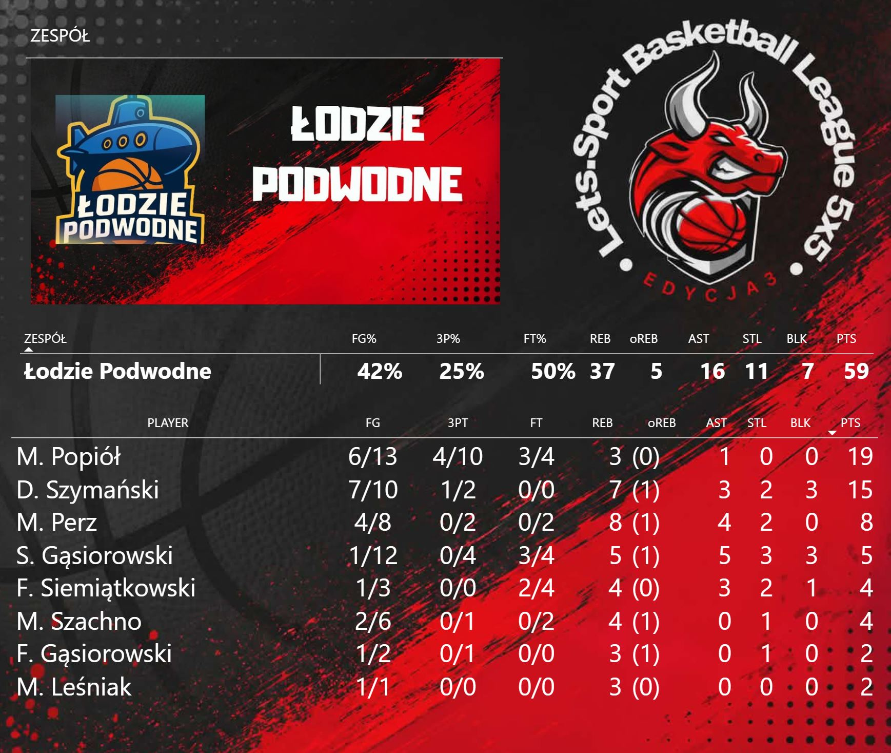
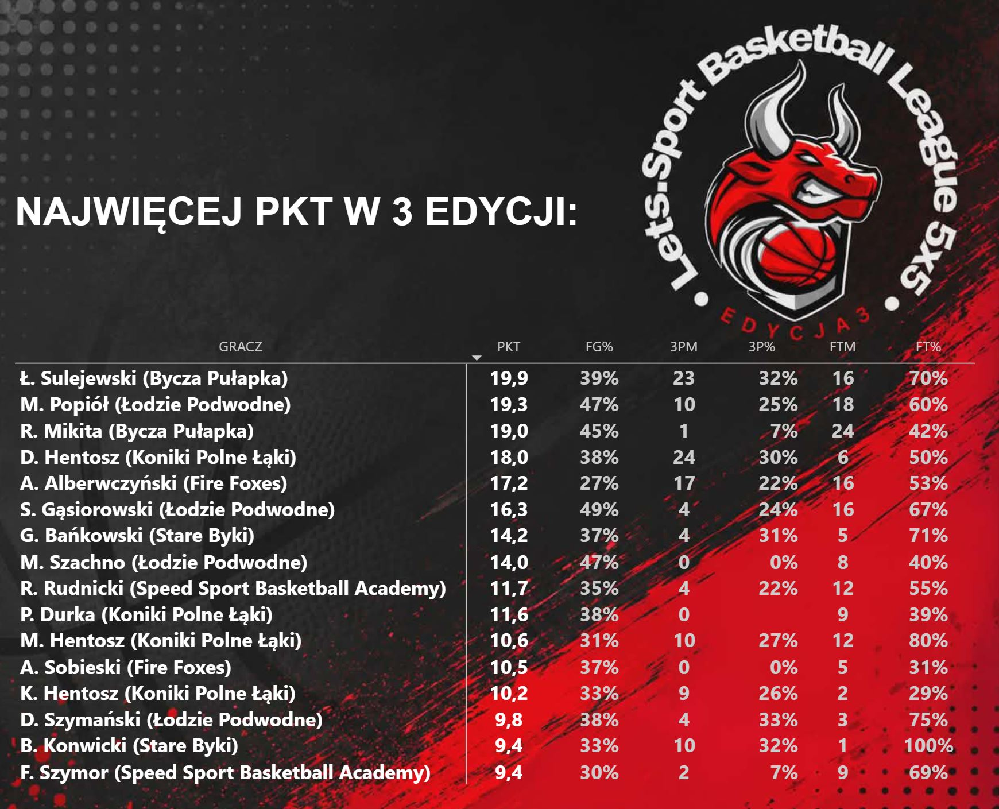
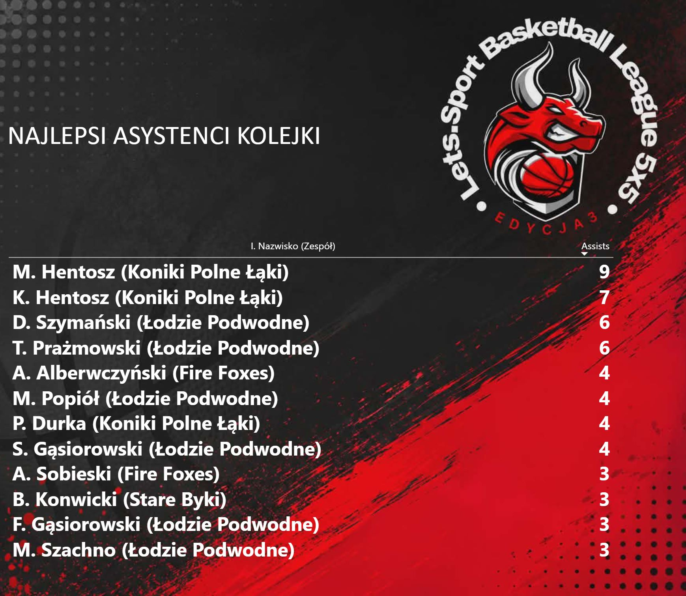
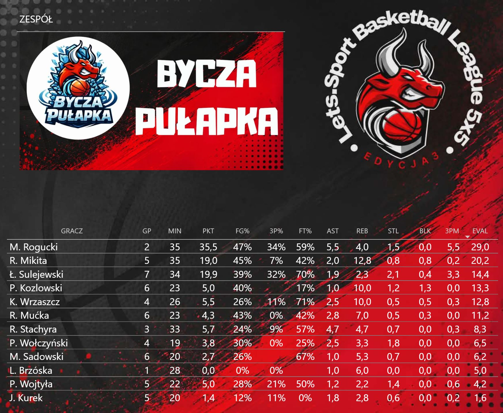
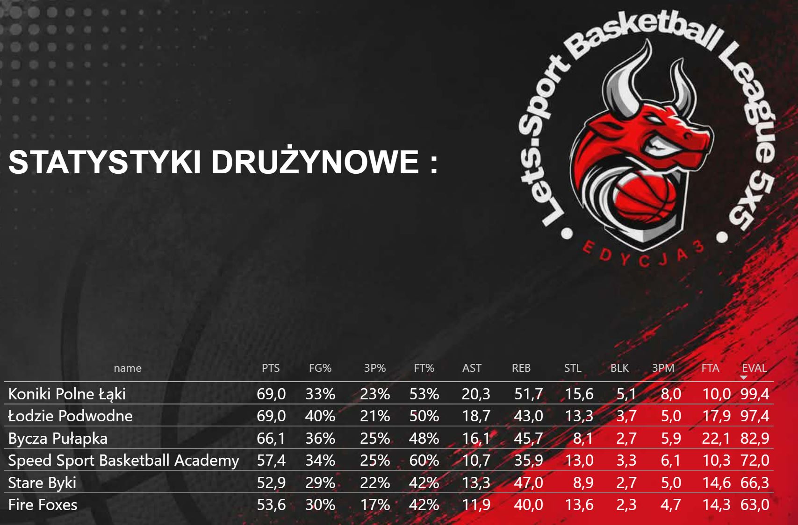
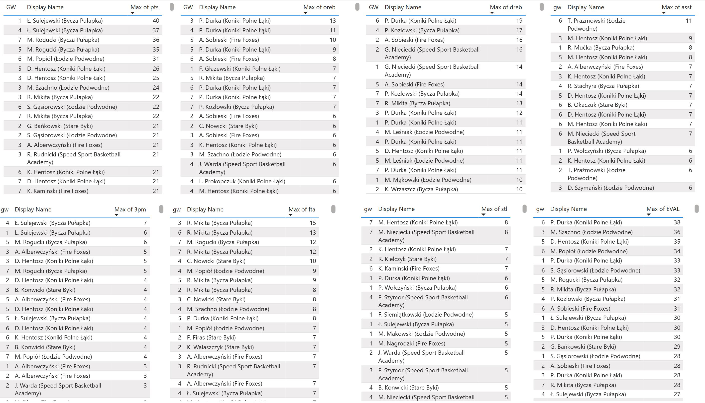

# basketball_analyticks_season_3_power_bi
Power BI project of season 3 summary in amateur basketball league
# 🏀 5-on-5 Basketball League – Season 3 (Power BI)

## 📥 Download Power BI File

➡️ 📥 [Download the Power BI report](https://github.com/karolwalaszczyk1989/basketball_analyticks_season_3_power_bi/blob/main/sezon3.pbix)

## 📌 Project Overview

This project presents a statistical analysis of the third season of a local 5-on-5 basketball league, built entirely in Power BI.

The report focuses on individual player performance, team statistics, season leaders and record-breaking performances.

Season 3 was played from May to June and featured 73 players across six teams.

The report was built using a relational data model, Power Query and DAX measures designed to handle player-level and game-level statistics correctly.

Unfortunately, my team did not manage to repeat the success of the previous season. We finished **6th**, so there is only one reasonable conclusion: **we will be looking for revenge next season.** 🏀

## 📊 Report Structure

Report was made to make a quick view of current gameweek. There were team stats and gameweek leadres avalible just in 1 click after refreshing data from fact table. Here are some examples of sections, leadres, records and also season overview for one team and for team stats:

### 1️⃣ Season Leaders

The report identifies the best individual performers of the season, including:

* Points leaders
* Rebounds leaders
* Assists leaders
* Steals leaders
* Blocks leaders
* Other selected statistical categories

### 2️⃣ Season Records

A separate section highlights the most impressive individual performances recorded during the season.

This includes single-game records and the highest values achieved across different statistical categories.

### 3️⃣ Player Season Averages

Player performance is summarized across the entire season, with statistics presented by team.

The report allows comparison of players based on their average production rather than only their cumulative totals.

Key statistics include:

* Points per game
* Rebounds per game
* Assists per game
* Steals
* Blocks
* Other performance indicators

### 4️⃣ Team Statistics

A compact team-level summary provides an overview of how the six teams performed during the season.

This section makes it possible to compare overall team production and identify differences between the teams.

### 5️⃣ 🏆 Season Summary

The final part of the report brings together the most important results from Season 3:

* League leaders
* Individual records
* Player averages
* Team statistics
* Overall season performance

## 🧱 Data Model

The report uses a relational data model designed to connect game results, players, teams and individual statistics.

The model allows the same underlying data to be analyzed at different levels of granularity:

* Individual game
* Player
* Team
* Entire season

Special attention was given to DAX calculations so that statistics aggregated across multiple games remain consistent with calculations performed for individual games.

## 🧠 Key Analytical Concepts Applied

* Context-aware DAX calculations
* Aggregation across individual games
* Player-level vs game-level calculations
* Team-level aggregation
* Season averages
* Ranking and leader calculations
* Single-game record detection
* Correct filter context handling
* Relational data modeling
* Dynamic Power BI visuals

## 🛠 Tools & Technologies

* Power BI
* DAX
* Power Query
* Relational Data Modeling

## 🎯 Project Purpose

The goal of this project was not only to create a basketball statistics dashboard, but also to use a real-world dataset to develop and test more advanced Power BI modeling and DAX techniques.

The project combines statistical analysis with a practical use case: tracking an entire basketball league season and turning raw game statistics into a structured analytical report.

Season 3 also provides a useful benchmark for comparison with previous and future seasons — both statistically and, unfortunately for my team, in the league standings.

**Final result: 6th place.**

**Next season: revenge.** 🏀
